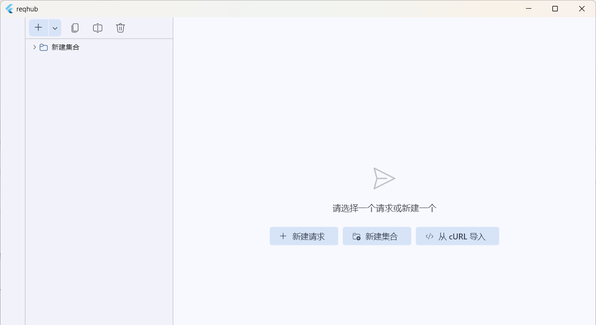
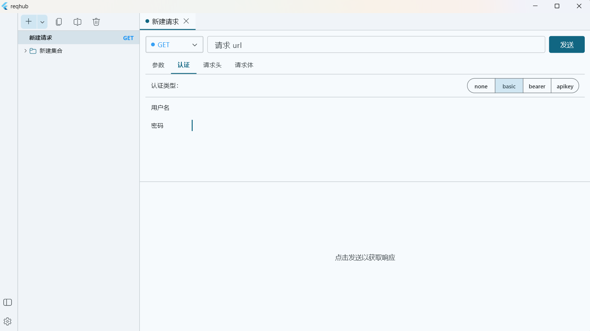
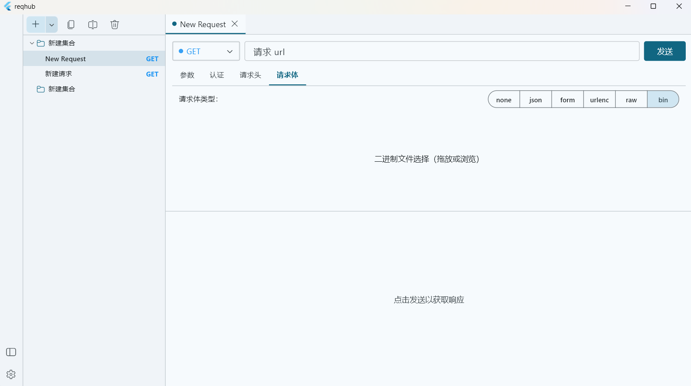

<p align="center">
  <strong>ReqHub</strong>
</p>

<p align="center">一款轻量、专注于 Windows 的 HTTP API 客户端。</p>

<p align="center">
  <a href="https://github.com/CandyRGB/ReqHub"></a>
  <a href="https://flutter.dev"></a>
  <a href="https://dart.dev"></a>
  <a href="https://github.com/CandyRGB/ReqHub/blob/main/pubspec.yaml"></a>
</p>

<p align="center">
  <a href="#功能">功能</a> ·
  <a href="#开始使用">开始使用</a> ·
  <a href="#开发">开发</a> ·
  <a href="docs/architecture.md">架构</a>
</p>

<p align="center">
  <a href="README.md">English</a> · 简体中文
</p>

ReqHub 提供一个专注的工作区，用于组织请求、配置认证和请求体、发送 HTTP 请求以及查看响应。

## 功能

- 使用嵌套集合组织请求，并支持多标签页打开。
- 支持常见 HTTP 方法、查询参数、请求头和认证方式：
  - 无认证
  - Basic 认证
  - Bearer Token
  - 添加到请求头或查询参数的 API Key
- 支持 JSON、表单、URL 编码、原始文本和二进制文件请求体。
- 从 cURL 导入请求，也可以将请求导出为 cURL。
- 查看响应状态、耗时、大小、响应体、响应头和 Cookie。
- 在本地持久化保存请求集合和应用设置。
- 支持浅色、深色和跟随系统主题。
- 支持简体中文和英语界面。

## 页面截图

### 工作区



### 认证配置



### 二进制请求体



## 环境要求

- Windows 10 或更高版本
- 兼容 Dart `^3.11.5` 的 Flutter SDK
- 安装 **Desktop development with C++** 工作负载的 Visual Studio

## 开始使用

克隆仓库并安装依赖：

```bash
git clone https://github.com/CandyRGB/ReqHub.git
cd ReqHub
flutter pub get
```

在 Windows 上运行：

```bash
flutter run -d windows
```

构建 Windows 发布版本：

```bash
flutter build windows
```

应用默认将用户数据和设置保存到 `%APPDATA%\ReqHub\`。

## 开发

提交修改前运行静态分析和测试：

```bash
flutter analyze
flutter test
```

修改 Freezed 或 JSON 序列化模型后，重新生成相关文件：

```bash
dart run build_runner build --delete-conflicting-outputs
```

## 项目结构

```text
lib/
├── config/       # 主题和颜色配置
├── l10n/         # 英语和简体中文本地化
├── models/       # Freezed 不可变数据模型
├── providers/    # Riverpod 应用状态
├── screens/      # 主界面和设置界面
├── services/     # HTTP、存储、cURL 和导出服务
└── widgets/      # 请求、响应、侧边栏和通用 UI 组件

test/
├── unit/         # 模型、Provider 和服务测试
└── widget_test.dart
```

详细的数据流和 Provider 架构请参阅 [`docs/architecture.md`](docs/architecture.md)。

## 技术栈

- [Flutter](https://flutter.dev/) — UI 框架
- [Dio](https://pub.dev/packages/dio) — HTTP 客户端
- [Riverpod](https://riverpod.dev/) — 状态管理
- [Freezed](https://pub.dev/packages/freezed) — 不可变模型生成
- [Fluent UI](https://pub.dev/packages/fluent_ui) — Windows 风格设计系统

## 当前范围

ReqHub 当前面向 Windows 桌面端使用。项目仍在持续开发中，API 客户端能力和界面细节可能会随版本继续调整。
